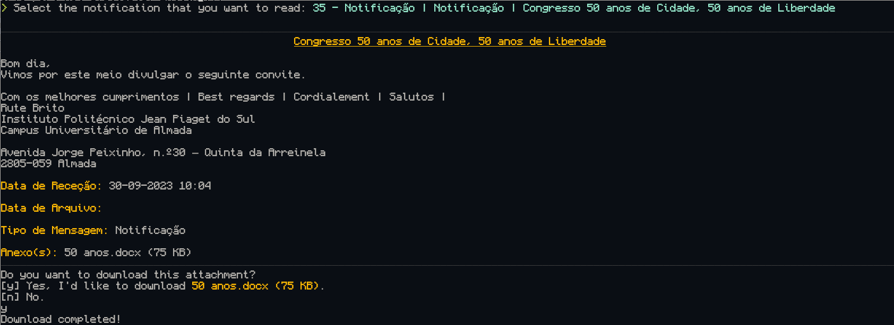

<h3 align="center">
A cli tool to see and read your emails from Piaget. This tool scrapes the site <a href="https://inforestudante.ipiaget.org">infoestudante</a>
</h3>



> [!WARNING]  
> This project just works for Linux (and probably MacOS).

## Features
- Automatic login.
- Read all your emails in [Markdown](https://en.wikipedia.org/wiki/Markdown) with ${{\color{Goldenrod}{\textsf{pretty colors}}}}\$.
- Download any email attachment.

## Usage
```
CLI tool to read notifications from Piaget

Usage: piaget-cli <COMMAND>

Commands:
  read, -r    Search for your read notifications
  unread, -u  Search for your unread notifications
    Usage: piaget-cli {unread|-u} [COMMAND]
    
    Commands:
      number, -n  Get the number of your unread notifications
      help        Print this message or the help of the given subcommand(s)
    
    Options:
      -h, --help  Print help
      help        Print this message or the help of the given subcommand(s)

Options:
  -h, --help  Print help
```

## Dependencies

- [rust](https://www.rust-lang.org/learn/get-started)
- [chromedriver](https://chromedriver.chromium.org/downloads)
